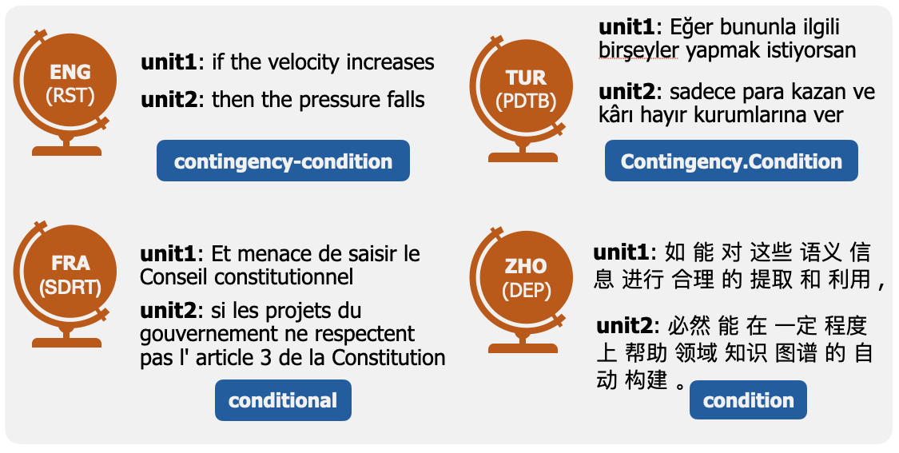

# Probing LLMs for Multilingual Discourse Generalization Through a Unified Label Set

[](https://github.com/mainlp/discourse_probes/tree/main)
[](https://github.com/mainlp/discourse_probes/blob/main/LICENSE)
[](https://github.com/mainlp/discourse_probes/blob/main/)



This is the code repository with the implementations of our submission. You can find our unified label set under `data/unified_labels.json`.

## Quick Start

To reproduce our results, you need to first download the DISRPT 2023 dataset (see next section). Furthermore, you need to install a few non-standard python packages:

```
pip install torch transformers pandas numpy plotly scikit-learn
```

We then provide a script to obtain `.csv` tables of the relation classification datasets by running

```
python discourse/read_disrpt.py
```

which will create new partitions in the directory where you put your DISRPT files. You should copy these datasets to a new folder, let's say `rel_embeddings_aya23_35b/`. Finally, you can start computing attention representations using the following script:

```
python discourse/encode_att.py results/rel_embeddings_aya23_35b/ CohereForAI/aya-23-35B
```


where the last argument refers to the [Huggingface](https://huggingface.co/CohereForAI/aya-23-35B) identifier of the model you want to use. The script will create necessary subdirectory and store checkpoints every 100 documents which will be skipped if you restart the script. Once the encoding is terminated you can use our probing scripts to reproduce our probing results:

```
python discourse/run_probes.py discourse/rel_embeddings_aya23_35b/ unified  # probes using all layers of the model
python discourse/run_probes.py discourse/rel_embeddings_aya23_35b/ layer-wise  # layer-wise probes
python discourse/run_probes.py discourse/rel_embeddings_aya23_35b/ store-full-preds  # probe storing all prediction data and probe weights

# equivalent to all above:
python discourse/run_probes.py discourse/rel_embeddings_aya23_35b/ all
```

Once the probes have been calculated, you can run our plotting script to generate the plots and tables seen in the paper. They will be stored under `results/disco_probe_results/`.

```
python discourse/plots/make_plots.py
```


for your convenience, we've added the results of our own run in there already.

## Data

In order to run our experiments, you need to download a copy of the [DISRPT 2023](https://github.com/disrpt/sharedtask2023) dataset. You can find instructions on that in [their repository](https://github.com/disrpt/sharedtask2023). The resulting dataset should be put in `data/disrpt_private/` to work seamlessly with our code.

## DisCoDisCo

We implemented the results of the DisCoDisCo reference using the code provided in [their repository](https://github.com/gucorpling/DisCoDisCo). Instructions on how to run it are provided there. In `discodisco/` you can find the configs and bash scripts used to run our specific experiments. Here, you need to map the DISRPT dataset to our unified label set first by running the following command which will update the original DISRPT data with our proposed unified label set and create the corresponding dataset directories under `discodisco/data_unified/`:

```
python discodisco/scripts/data_modify.py
```


then, the following command will create the combined DISRPT data under `discodisco/output/mul.dis.all/`

```
python discodisco/scripts/combine_data.py
```


and then you can start training the model using our config and their script as follows

```
bash run_single_flair_clone_mul.sh mul.dis.all
```

where `mul.dis.all` contains the combined .rels and .conllu files. To obtain dataset-wise accuracy for all datasets, use the following script:

```
bash run_all_flair_clone_mul_test.sh
```


## AI Usage Disclaimer
The code in this repository has been written with the support of code completions of an AI coding assistant, namely GitHub Copilot. Completions were mostly single lines up to a few lines of code and were always checked carefully to ensure their functionality and safety. Furthermore, we did our best to avoid accepting code completions that would be incompatible with the license of our code or could be regarded as plagiarism.